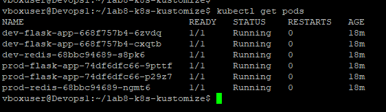
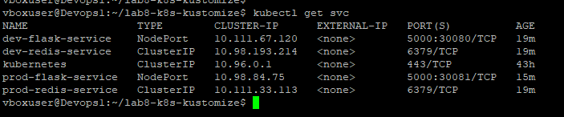
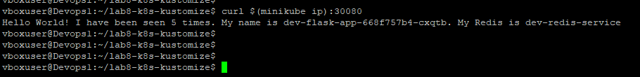
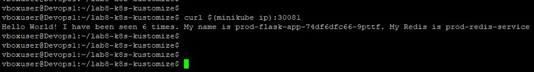

# Лабораторная работа 8. Kubernetes Kustomize

## Задача
1. Доработать приложение Flask, вынести имя сервера Redis в переменную окружения.
2. Добавить оверлейную кастомизацию (Kustomize) для запуска приложения в окружениях dev и prod.

## Структура проекта
```text
k8s/
├── base/ (базовые манифесты без привязки к окружению)
└── overlays/
    ├── dev/ (патчи и префиксы для dev)
    └── prod/ (патчи и префиксы для prod)
```

## Как запустить

### Применить окружение dev:
```bash
kubectl apply -k k8s/overlays/dev/
```
### Применить окружение prod:
```bash
kubectl apply -k k8s/overlays/prod/
```
## Результат
### Развернуты два независимых стека Flask+Redis. Kustomize автоматически изменил имена ресурсов (добавил префиксы dev- и prod-) и через патчи передал в контейнеры Flask правильные DNS-имена сервисов Redis.


## Проверка
### Проверка работы приложения через curl. Приложение из `dev` окружения подключается к `dev-redis-service`, а из `prod` к `prod-redis-service`.

## Скриншоты

### Вывод команды kubectl get pods


### Вывод команды kubectl get svc


### Результат curl на порт 30080, где видно dev-redis-service


### Результат curl на порт 30081, где видно prod-redis-service


